# Simulação de atendimento no Jira Service Management

Laboratório de Service Desk com 10 chamados fictícios, atendidos de ponta a ponta. Usei duas contas: uma de **cliente** (portal) e outra de **analista de suporte** (fila de atendimento). Todos os dados são fictícios.

## O que pratiquei
- Abertura e classificação de chamados pelo portal
- Diagnóstico registrado em **nota interna** e solução em **resposta ao cliente**
- Definição de prioridade, acompanhamento e fechamento
- **Escalada** de casos de acesso e segurança, com os dados coletados
- Aplicação do princípio de **privilégio mínimo** e confirmação de identidade antes de mexer em acessos

## Fila de chamados
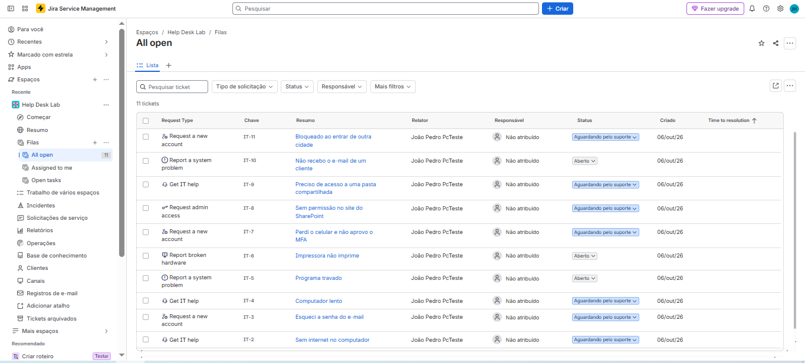

## Resumo

| # | Chamado | Grupo no portal | Prioridade | Resultado |
|---|---|---|---|---|
| 1 | Sem internet no computador | Common requests | Média | Resolvido |
| 2 | Esqueci a senha do e-mail | Login and account | Média | Resolvido |
| 3 | Computador lento | Computers | Baixa | Resolvido |
| 4 | Programa travado | Applications | Média | Resolvido |
| 5 | Impressora não imprime | Computers | Média | Resolvido |
| 6 | Perdi o celular e não aprovo o MFA | Login and account | Alta | Escalado |
| 7 | Sem permissão no site do SharePoint | Applications | Média | Escalado |
| 8 | Acesso a pasta compartilhada | Common requests | Baixa | Resolvido após aprovação |
| 9 | Não recebo o e-mail de um cliente | Applications | Média | Resolvido |
| 10 | Bloqueado ao entrar de outra cidade | Login and account | Alta | Escalado |

---

## Chamado 1: Sem internet no computador
**Grupo:** Common requests | **Prioridade:** Média | **Status:** Resolvido

**Descrição do usuário:** "O Wi-Fi aparece conectado, mas as páginas não abrem desde hoje cedo. Já reiniciei o computador e continua igual."

**Diagnóstico (nota interna):**
Verificado com `ipconfig /all`: o computador recebeu IP, gateway e DNS. `ping 8.8.8.8` respondeu normalmente e `ping google.com` falhou. Causa provável: problema de resolução de nomes (DNS). Executado `ipconfig /flushdns` e conferido o servidor DNS configurado. Navegação normalizada após o procedimento.

**Solução (resposta ao cliente):**
Olá! Identificamos que a conexão estava funcionando, mas a resolução de nomes (DNS) estava com problema. Limpamos o cache de DNS e a navegação voltou ao normal. Pode testar abrindo um site e confirmar se está tudo certo? Se o problema voltar, responda aqui.

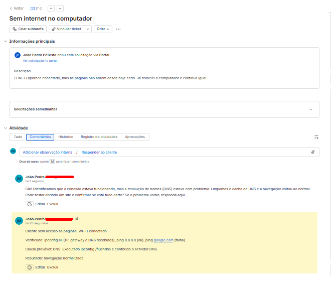

---

## Chamado 2: Esqueci a senha do e-mail
**Grupo:** Login and account | **Prioridade:** Média | **Status:** Resolvido

**Descrição do usuário:** "Esqueci a senha do meu e-mail e não consigo entrar."

**Diagnóstico (nota interna):**
Identidade confirmada conforme o procedimento (nome completo, departamento e um dado de validação). Verificado se o usuário tinha métodos de verificação cadastrados (telefone e aplicativo autenticador). Orientado a usar a redefinição de senha por autoatendimento. Nenhuma senha foi solicitada ou registrada no chamado.

**Solução (resposta ao cliente):**
Olá! Confirmamos sua identidade e orientamos a redefinição da senha pelo autoatendimento, usando seu método de verificação cadastrado. Depois de entrar, recomendamos ativar a verificação em duas etapas (MFA), se ainda não estiver ativa. Pode confirmar se conseguiu acessar? Por segurança, nunca envie sua senha por este canal.

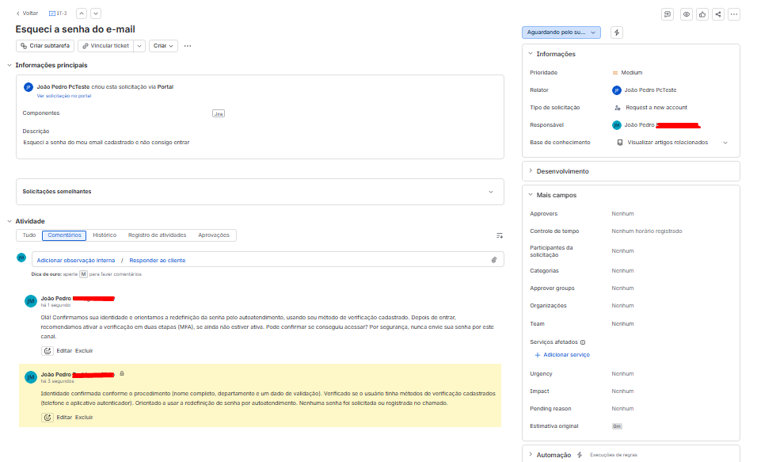

---

## Chamado 3: Computador lento
**Grupo:** Computers | **Prioridade:** Baixa | **Status:** Resolvido

**Descrição do usuário:** "O computador está muito lento para ligar e para abrir os programas."

**Diagnóstico (nota interna):**
No Gerenciador de Tarefas, verificado o consumo de CPU, memória e disco. Na aba Inicializar, identificados programas com alto impacto na inicialização. Conferidos o espaço livre no disco e as atualizações pendentes. Desativados apenas os programas de inicialização conhecidos e dispensáveis. Reiniciado o equipamento e comparado o tempo de inicialização.

**Solução (resposta ao cliente):**
Olá! Encontramos vários programas abrindo junto com o Windows e deixando o sistema pesado. Desativamos os desnecessários na inicialização e conferimos o espaço em disco. Após reiniciar, o computador ficou mais rápido. Se a lentidão voltar, nos avise para investigarmos outras causas.

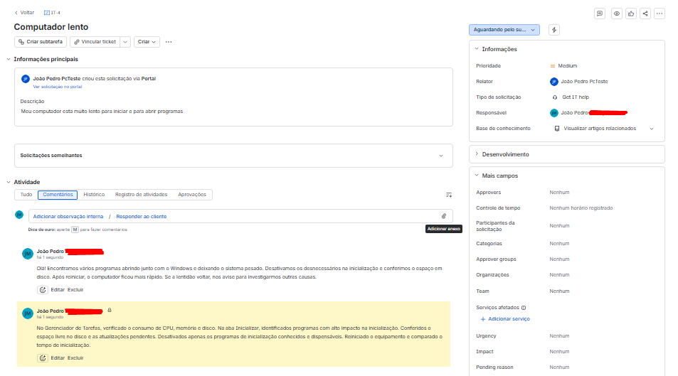

---

## Chamado 4: Programa travado
**Grupo:** Applications | **Prioridade:** Média | **Status:** Resolvido

**Descrição do usuário:** "O programa travou e a janela não fecha."

**Diagnóstico (nota interna):**
Usuário avisado de que dados não salvos poderiam ser perdidos. Finalizada a tarefa pelo Gerenciador de Tarefas. No Visualizador de Eventos (Logs do Windows > Aplicativo), localizado um evento de erro no horário da falha, relacionado ao programa. Recomendada a atualização do programa.

**Solução (resposta ao cliente):**
Olá! Encerramos o programa travado e reabrimos normalmente. Verificamos o registro de erros do sistema e recomendamos manter o programa atualizado. Se o travamento se repetir, nos avise e vamos investigar a fundo.

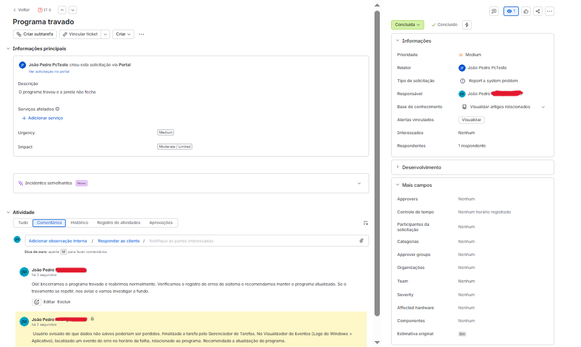

---

## Chamado 5: Impressora não imprime
**Grupo:** Computers | **Prioridade:** Média | **Status:** Resolvido

**Descrição do usuário:** "Mando imprimir e nada sai da impressora."

**Diagnóstico (nota interna):**
Confirmados: impressora ligada, com papel e toner, conectada à rede. Verificado que estava definida como impressora padrão e que havia documentos presos na fila de impressão. Reiniciado o serviço de spooler (`net stop spooler` e `net start spooler`) e limpada a fila. Teste de impressão realizado com sucesso.

**Solução (resposta ao cliente):**
Olá! Havia documentos presos na fila de impressão. Limpamos a fila, reiniciamos o serviço de impressão e fizemos um teste que funcionou. Pode imprimir e confirmar se está tudo certo?

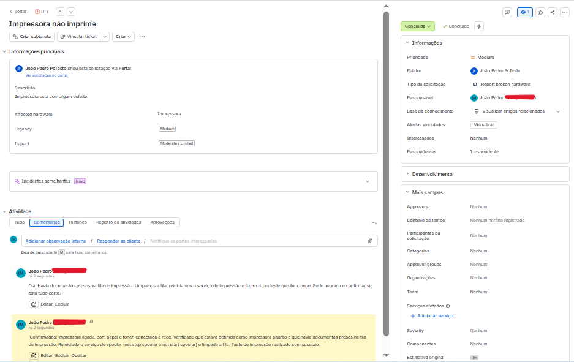

---

## Chamado 6: Perdi o celular e não aprovo o MFA
**Grupo:** Login and account | **Prioridade:** Alta | **Status:** Escalado (rótulo `escalado-n2`)

**Descrição do usuário:** "Perdi meu celular e não consigo aprovar o login pelo aplicativo autenticador."

**Diagnóstico (nota interna):**
ESCALADO PARA N2 (Identidade e Acesso). O reset do método de MFA só deve ser feito após validação de identidade por um canal confiável, conforme o procedimento. Dados coletados: usuário, horário da última tentativa, aplicativo e método cadastrado. Ação solicitada: validar a identidade e redefinir o registro de MFA para novo cadastro.

**Solução (resposta ao cliente):**
Olá! Por segurança, a redefinição do MFA precisa ser feita pela equipe de identidade, depois de confirmar sua identidade. Já encaminhei o seu caso com todos os detalhes. Quando o reset for feito, você poderá cadastrar o novo celular. Aviso por aqui assim que houver retorno.

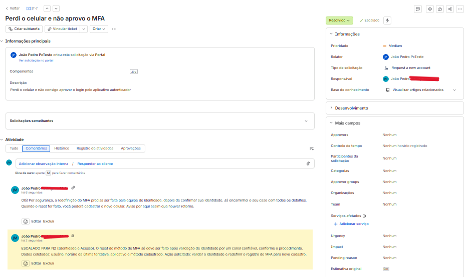

---

## Chamado 7: Sem permissão no site do SharePoint
**Grupo:** Applications | **Prioridade:** Média | **Status:** Escalado (rótulo `escalado-n2`)

**Descrição do usuário:** "Não consigo abrir o site do SharePoint da equipe. Aparece que não tenho permissão."

**Diagnóstico (nota interna):**
ESCALADO. Coletados: endereço do site, nível de acesso pretendido (ver ou editar) e justificativa. Pendente aprovação do dono do site. Seguindo o privilégio mínimo, solicitado apenas o nível necessário (Visitante para leitura).

**Solução (resposta ao cliente):**
Olá! O acesso a esse site precisa da aprovação do responsável por ele. Já encaminhei seu pedido com o nível de acesso necessário e a justificativa. Quando for liberado, aviso por aqui.

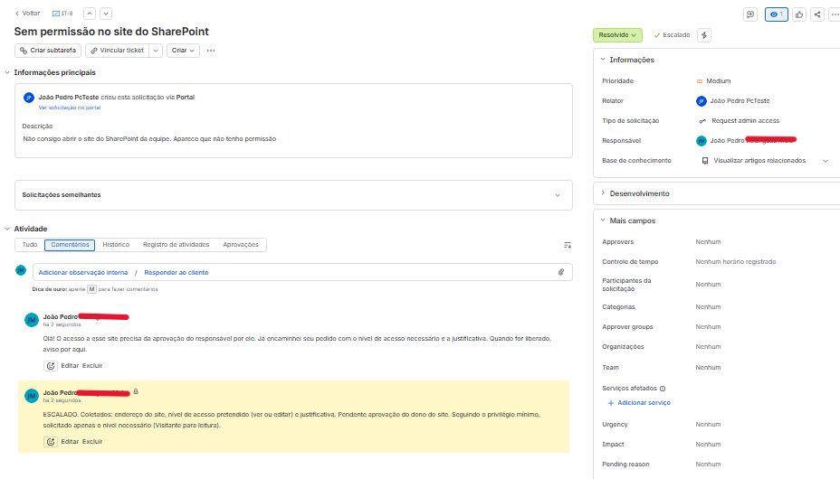

---

## Chamado 8: Acesso a pasta compartilhada
**Grupo:** Common requests | **Prioridade:** Baixa | **Status:** Resolvido após aprovação

**Descrição do usuário:** "Preciso de acesso à pasta compartilhada do departamento."

**Diagnóstico (nota interna):**
Solicitados o caminho da pasta e a justificativa. Pedida e registrada a aprovação do gestor (nome e data). Com a aprovação, usuário adicionado ao grupo de segurança que dá o acesso, mantendo o privilégio mínimo (apenas leitura).

**Solução (resposta ao cliente):**
Olá! Com a aprovação do seu gestor, liberamos o acesso à pasta. Pode ser necessário sair e entrar novamente na sua conta para o acesso aparecer. Confirma se está tudo certo?

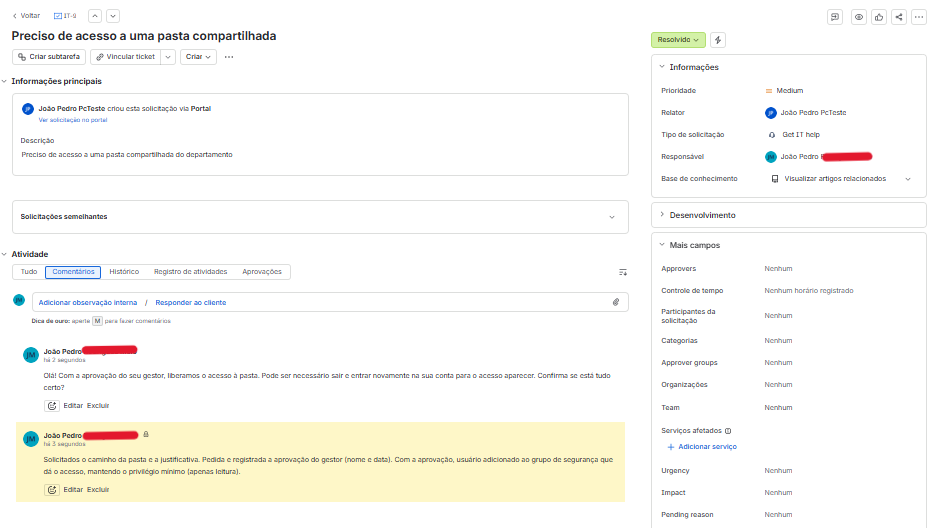

---

## Chamado 9: Não recebo o e-mail de um cliente
**Grupo:** Applications | **Prioridade:** Média | **Status:** Resolvido

**Descrição do usuário:** "Um cliente diz que mandou e-mail para mim, mas não chegou."

**Diagnóstico (nota interna):**
Confirmados o endereço exato do remetente e o horário do envio. Verificada a pasta Lixo Eletrônico, onde a mensagem foi encontrada. Marcado o remetente como seguro. Se a mensagem não estivesse lá, o caso seria escalado para verificação de quarentena e rastreamento da mensagem.

**Solução (resposta ao cliente):**
Olá! O e-mail do seu cliente tinha sido enviado para a pasta Lixo Eletrônico. Movemos a mensagem para a caixa de entrada e marcamos o remetente como seguro, para que as próximas cheguem normalmente.

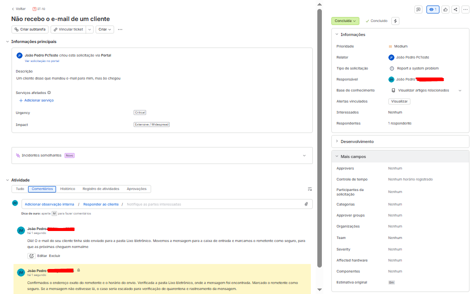

---

## Chamado 10: Bloqueado ao entrar de outra cidade
**Grupo:** Login and account | **Prioridade:** Alta | **Status:** Escalado (rótulo `escalado-n2`)

**Descrição do usuário:** "Estou viajando e não consigo entrar no e-mail. Aparece que o acesso foi bloqueado."

**Diagnóstico (nota interna):**
ESCALADO PARA N2 (Identidade e Acesso).
- Usuário: [fictício]
- Data e hora da falha: [data, hora e fuso]
- Aplicativo: Microsoft 365 (Outlook na web)
- Dispositivo: notebook de trabalho, rede de hotel
- Mensagem: acesso bloqueado por política da organização
- Verificado: senha correta e MFA funcionando
- Hipótese: política de Acesso Condicional baseada em local
- Impacto: usuário em viagem sem acesso ao e-mail
- Prioridade sugerida: alta
- Ação solicitada: verificar os logs de entrada e avaliar exceção temporária

**Solução (resposta ao cliente):**
Olá! Identificamos que o bloqueio vem de uma regra de segurança da empresa ligada ao local de acesso. Já encaminhei seu caso à equipe responsável, com todos os detalhes. Assim que houver uma definição, aviso por aqui.

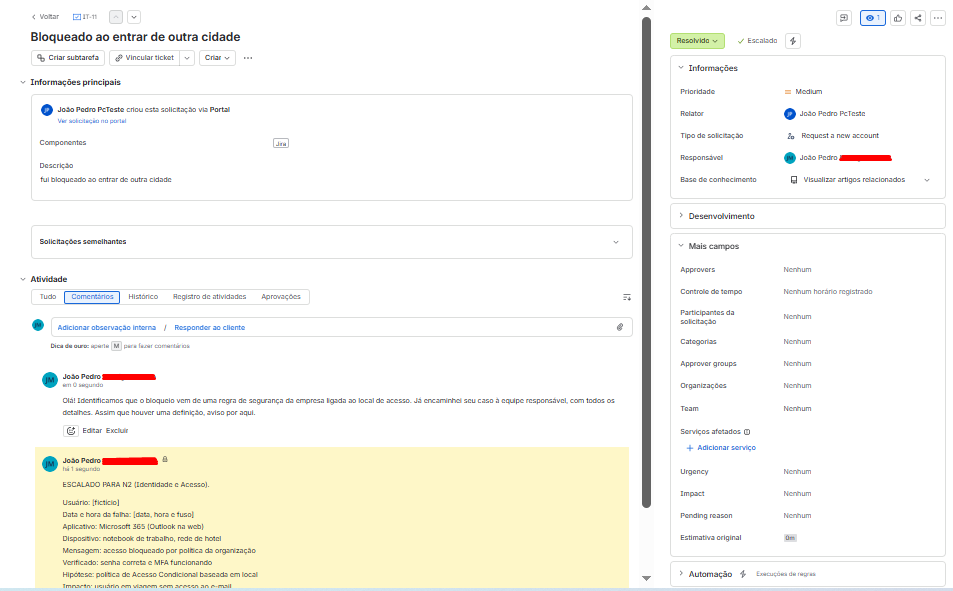

---

## Aprendizados
- Separar **nota interna** (para a equipe) de **resposta ao cliente** (linguagem simples) deixa o atendimento mais claro.
- Em casos de acesso e segurança, o papel do N1 é **coletar os dados certos e escalar**, sem alterar políticas.
- Registrar quem aprovou cada acesso e dar só o nível necessário (privilégio mínimo) faz parte do atendimento seguro.
